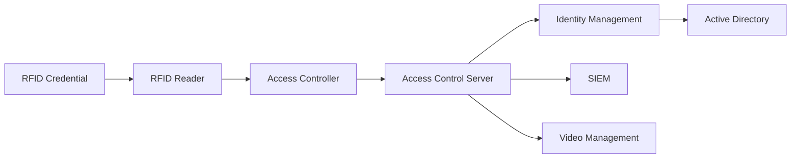

---
title: "Görünmez Sınırları Aşmak: Bir Pentester Gözünden RFID Güvenliği, Fiziksel Erişim Sistemleri ve Modern Saldırı Yüzeyi"
author: Burak Balta
description: RFID teknolojisinin çalışma prensipleri, kurumsal fiziksel erişim kontrol sistemleri (PACS), modern güvenlik mimarileri ve savunma yaklaşımlarına teknik bir bakış.
tags:
- RFID
- Physical Security
- Red Team
- Pentest
- Cyber Security
- PACS
readingTime: "20-25 min"
---

# Görünmez Sınırları Aşmak

## Bir Pentester Gözünden RFID Güvenliği, Fiziksel Erişim Sistemleri ve Modern Saldırı Yüzeyi

> **Not**
>
> Bu makale, fiziksel erişim kontrol sistemlerini savunma perspektifinden ele almaktadır. Amaç; RFID teknolojisinin çalışma prensiplerini, kurumsal mimarilerdeki yerini ve modern güvenlik yaklaşımlarını teknik temelleriyle açıklamaktır.

---

> **Şekil 1**
>
> Modern bir ofis girişinde RFID okuyucu, kurumsal erişim kartı ve arka planda dijital ağ mimarisini temsil eden soyut güvenlik görselleştirmesi.

---

# Giriş

> *"Bir saldırgan için kurum ağına açılan ilk kapı çoğu zaman VPN değildir. O kapı, her sabah yüzlerce çalışanın farkında bile olmadan kullandığı kart okuyucusudur."*

Kurumsal bilgi güvenliği denildiğinde akla ilk olarak güvenlik duvarları, uç nokta koruma çözümleri (EDR), çok faktörlü kimlik doğrulama (MFA), Active Directory altyapıları veya bulut güvenliği gelir. Günümüzde kurumların önemli bir bölümü güvenlik yatırımlarını bu alanlara yöneltmektedir. Bunun temel nedeni, siber saldırıların büyük kısmının internet üzerinden gerçekleştiği düşüncesidir.

Gerçek Red Team operasyonları ise saldırı yüzeyinin yalnızca ağ servislerinden ibaret olmadığını gösterir. Kurumun fiziksel güvenlik katmanında bulunan bir zafiyet, güçlü görünen birçok dijital güvenlik mekanizmasını dolaylı olarak etkisiz hâle getirebilir. Bir saldırganın aynı yerel ağ üzerinde bulunması ile internet üzerinden erişmeye çalışması arasında ciddi fark vardır. Fiziksel erişim elde edildiğinde kullanılabilecek teknikler kadar, kurum çalışanlarıyla kurulabilecek etkileşimler ve operasyonel süreçlerdeki eksiklikler de saldırı yüzeyini genişletebilir.

Bu nedenle günümüzde fiziksel güvenlik ile bilgi güvenliği birbirinden bağımsız iki disiplin olarak değerlendirilemez. Özellikle büyük ölçekli organizasyonlarda fiziksel erişim kontrol sistemleri (Physical Access Control Systems - PACS), kurumsal kimlik yönetimi, güvenlik operasyon merkezleri ve olay izleme platformlarıyla doğrudan entegre çalışmaktadır.

Bir çalışanın binaya giriş yapması yalnızca kapının açılması anlamına gelmez. Aynı anda;

- kimlik doğrulama işlemi gerçekleştirilir,
- erişim politikaları değerlendirilir,
- olay kayıtları oluşturulur,
- merkezi log altyapısına veri gönderilir,
- gerektiğinde SIEM platformlarında korelasyon kuralları çalıştırılır,
- fiziksel erişim bilgisi diğer güvenlik olaylarıyla ilişkilendirilebilir.

Dolayısıyla fiziksel erişim artık yalnızca güvenlik görevlilerinin veya bina yönetiminin sorumluluğunda olan bağımsız bir sistem değildir. Kurumsal siber güvenlik mimarisinin aktif bir bileşeni hâline gelmiştir.

Bu mimarinin merkezinde ise uzun yıllardır RFID teknolojisi yer almaktadır.

---

# Neden RFID Hâlâ Bu Kadar Yaygın?

Bugün ofis binalarında kullanılan personel kartlarından veri merkezlerine, üretim tesislerinden üniversite kampüslerine kadar birçok fiziksel erişim sistemi RFID tabanlıdır.

Bu kadar yaygın kullanılmasının temel nedenleri şunlardır:

- düşük operasyonel maliyet,
- hızlı kimlik doğrulama,
- temassız kullanım,
- merkezi yönetim kolaylığı,
- farklı kimlik yönetim sistemleriyle entegrasyon desteği,
- uzun donanım ömrü.

Kullanıcı açısından süreç son derece basittir.

Kart okuyucuya yaklaştırılır.

Yaklaşık birkaç yüz milisaniye içerisinde doğrulama tamamlanır.

Kapı açılır.

Ancak bu basit görünen işlem, arka planda çok daha karmaşık bir mimari tarafından yürütülmektedir.

---

# Kart Okutulduğunda Arka Planda Ne Olur?

Bir RFID kartının okuyucuya yaklaştırılmasıyla birlikte yalnızca kart ve okuyucu arasında haberleşme gerçekleşmez.

Aslında aşağıdaki zincirin tamamı devreye girer.

Bu mimaride her bileşen farklı güvenlik sorumluluklarına sahiptir.

Kart yalnızca dijital kimliği temsil eder.

Okuyucu fiziksel katmandaki ilk güven sınırıdır.

Kontrol paneli erişim kararını üretir.

Merkezi sunucu kullanıcı politikalarını yönetir.

Kimlik yönetim sistemi kullanıcı yaşam döngüsünü kontrol eder.

SIEM ise bütün bu olayları güvenlik analistleri için anlamlı hâle getirir.

Dolayısıyla güvenlik yalnızca kart üzerinde değil, zincirin tamamında değerlendirilmelidir.

---

# Bir Pentester Aynı Sisteme Nasıl Bakar?

Kullanıcı için okuyucu yalnızca duvara monte edilmiş küçük bir cihazdır.

Bir penetrasyon test uzmanı için ise aynı cihaz;

- radyo frekansı haberleşmesi,
- gömülü sistemler,
- kimlik doğrulama protokolleri,
- haberleşme güvenliği,
- ağ mimarisi,
- Active Directory entegrasyonu,
- olay kayıtları,
- erişim politikaları

gibi birçok farklı güvenlik katmanının başlangıç noktasıdır.

Bu nedenle profesyonel fiziksel güvenlik değerlendirmelerinde temel amaç yalnızca kart teknolojisini incelemek değildir.

Asıl amaç;

> **"Fiziksel erişim güven zincirinin herhangi bir halkasında kurumun risk oluşturabilecek tasarım veya yapılandırma eksiklikleri bulunuyor mu?"**

sorusuna teknik verilerle cevap verebilmektir.

---

# Bu Makalede Neleri İnceleyeceğiz?

Bu yazı boyunca RFID teknolojisini yalnızca kartlar üzerinden değerlendirmeyeceğiz.

Bunun yerine fiziksel erişim kontrol sistemlerini uçtan uca ele alacağız.

Ele alınacak başlıca konular şunlardır:

- RFID teknolojisinin fiziksel çalışma prensibi
- Elektromanyetik indüksiyon
- LF, HF ve UHF sistemlerinin karşılaştırılması
- ISO/IEC 14443 standardı
- RFID kart teknolojileri
- Kurumsal PACS mimarileri
- Active Directory ve IAM entegrasyonları
- SIEM korelasyonu
- OSDP Secure Channel
- Zero Trust Physical Access
- Mobil kimlik teknolojileri
- Yapay zekâ destekli davranış analitiği
- Geleceğin fiziksel erişim sistemleri

Makalenin amacı saldırı yöntemlerini öğretmek değil; kurumların fiziksel erişim altyapılarının neden kritik olduğunu açıklamak, modern güvenlik standartlarını tanıtmak ve savunma bakış açısıyla daha güvenli sistemlerin nasıl tasarlanabileceğini ortaya koymaktır.

---

> 📖 **Sonraki Bölüm**
>
> **RFID Teknolojisinin Temelleri**
>
> Elektromanyetik indüksiyon, pasif ve aktif etiketler, ISO/IEC 14443, UID, ATS, APDU, anti-collision algoritmaları ve RFID haberleşmesinin fiziksel katmanı ayrıntılı olarak incelenecektir.
